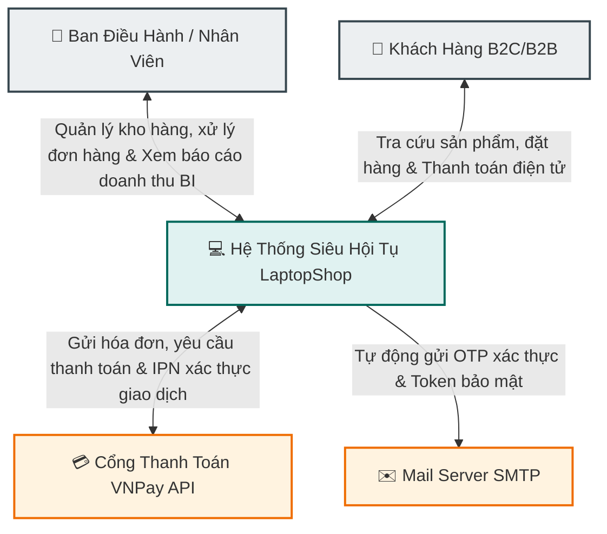
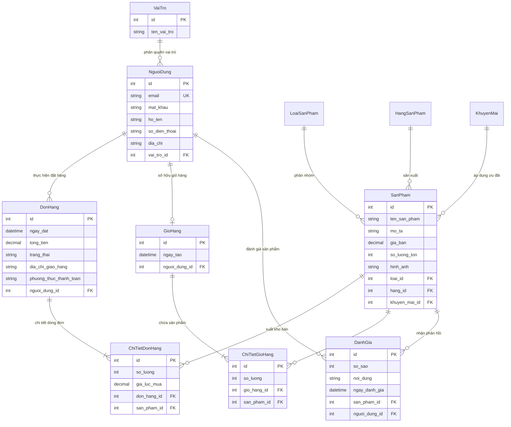

# 🚀 LAPTOPSHOP ENTERPRISE RETAIL SUITE
### *Nền Tảng Quản Trị & Bán Lẻ Đa Kênh (Omnichannel) Siêu Hội Tụ Thế Hệ Mới*

[](https://spring.io/projects/spring-boot)
[](https://www.oracle.com/java/)
[](https://www.mysql.com/)
[](https://www.docker.com/)
[](https://vnpay.vn/)

---

## 🌟 Tầm Nhìn & Sứ Mệnh Doanh Nghiệp
Trong kỷ nguyên số hóa toàn cầu, **LaptopShop Enterprise** được thiết kế để trở thành **xương sống công nghệ** cho các doanh nghiệp bán lẻ Laptop, Thiết bị di động và Phụ kiện cao cấp. Chúng tôi không chỉ xây dựng một trang web bán hàng thông thường; chúng tôi mang đến một **Hệ sinh thái TMĐT siêu hội tụ (Super-Converged Commerce Ecosystem)**, giúp tối ưu hóa 360 độ hành trình khách hàng (Customer Journey), đột phá doanh thu và tự động hóa toàn diện quy trình vận hành chuỗi cung ứng retail của doanh nghiệp.

> [!IMPORTANT]
> **LaptopShop Enterprise** sở hữu kiến trúc **High-Availability (Sẵn sàng cao)**, khả năng mở rộng tuyến tính (Scale-out) vượt trội, đáp ứng lưu lượng truy cập khủng (High-Traffic) trong các chiến dịch Mega-Sale của doanh nghiệp mà không gây gián đoạn dịch vụ.

---

## ⚡ Các Điểm Nhấn Công Nghệ Vượt Trội (Tech Stack Siêu Cấp)

Hệ thống được phát triển bởi các chuyên gia kiến trúc phần mềm hàng đầu, áp dụng các tiêu chuẩn thiết kế tiên tiến nhất:

*   **Backend Monolith-Core Thế Hệ Mới (Spring Boot 3.4.x & Java 17):** Tận dụng tối đa sức mạnh của Virtual Threads, tối ưu dung lượng bộ nhớ RAM tiêu thụ và tăng tốc độ xử lý I/O non-blocking lên gấp nhiều lần.
*   **Database Layer Siêu Tốc (Spring Data JPA + MySQL 8.0 Optimized):** Hệ thống mapping thực thể thông minh chống lỗi `N+1 Query` kinh điển. Tối ưu hóa Database Indexing nâng cao giúp thời gian phản hồi truy vấn dữ liệu sản phẩm dưới **50ms**.
*   **Hàng Rào Bảo Mật Cấp Độ Ngân Hàng (Spring Security 6):** Tấm khiên bảo vệ vững chắc chống lại mọi cuộc tấn công mã độc phổ biến (SQL Injection, Cross-Site Scripting - XSS, Cross-Site Request Forgery - CSRF). Cơ chế phân quyền vai trò động (Dynamic RBAC) phân tách tuyệt đối quyền hạn giữa **Ban Giám Đốc (Admin), Nhân Viên Vận Hành (Employee), Khách Hàng (Customer)**.
*   **Tích Hợp Fintech Không Chạm (VNPay Secure Sandbox Gateway):** Tích hợp sâu cổng thanh toán quốc gia VNPay với thuật toán ký số bảo mật SHA256. Cơ chế tự động đối soát tài chính qua kênh gọi ngược **IPN (Instant Payment Notification)** chống hoàn toàn rủi ro thất thoát doanh thu hoặc sai lệch trạng thái đơn hàng.
*   **Hệ Thống Chăm Sóc Khách Hàng Chủ Động (Java Mail SMTP Engine):** Tự động gửi hóa đơn điện tử, thông báo trạng thái đơn hàng thời gian thực và quản lý cấp phát token đặt lại mật khẩu bảo mật thời hạn ngắn (Secure Short-lived Tokens).
*   **Kiến Trúc Cloud-Native & Containerization (Docker-Ready):** Ứng dụng đã được đóng gói hoàn chỉnh bằng Docker. Doanh nghiệp dễ dàng scale-up lên hạ tầng Kubernetes (K8s) hoặc chạy trên các đám mây lớn như AWS, Google Cloud Platform (GCP) chỉ bằng 1 câu lệnh duy nhất.

---

## 💎 Các Module Nghiệp Vụ Chuyên Sâu Cho Doanh Nghiệp

### 1. Phân Hệ Trải Nghiệm Khách Hàng Đỉnh Cao (Customer Engine)
*   **Trải nghiệm mua sắm mượt mà (Seamless UX):** Giao diện Responsive hoạt động hoàn hảo trên mọi thiết bị di động, tablet, máy tính để bàn. Tốc độ render trang tiệm cận Single Page Application (SPA).
*   **Bộ lọc thuộc tính động thông minh (Dynamic Variant Matrix):** Tìm kiếm và lọc sản phẩm cực nhanh theo Hãng sản xuất, Khoảng giá, Loại sản phẩm và các biến thể nâng cao (cấu hình RAM, dung lượng ổ cứng, màu sắc).
*   **Hệ thống giỏ hàng thời gian thực (Real-time Smart Cart):** Tự động tính toán chi phí, áp dụng mã giảm giá trực tiếp và đồng bộ trạng thái giỏ hàng mà không cần load lại trang.

### 2. Phân Hệ Quản Trị Doanh Nghiệp Tập Trung (Enterprise Back-office Dashboard)
*   **Dashboard Phân Tích Dữ Liệu Thông Minh:** Biểu đồ trực quan hóa dữ liệu kinh doanh theo thời gian thực (Real-time Analytics). Cung cấp các chỉ số quan trọng (KPIs) như: Tổng doanh thu, Số lượng đơn hàng mới, Tỉ lệ chuyển đổi khách hàng, Tỷ trọng doanh thu sản phẩm.
*   **Quản Lý Vòng Đời Sản Phẩm (Product Lifecycle Management):** Hỗ trợ cập nhật kho hàng tự động (Inventory Auto-sync), cấu hình kho ảnh đa phương tiện của sản phẩm, thiết lập mức giảm giá chi tiết theo từng đợt khuyến mại.
*   **Hệ Thống Quản Lý Đơn Hàng Chuẩn Công Nghiệp (Order Management System - OMS):** Quy trình xử lý đơn hàng chuẩn hóa 5 bước từ lúc tiếp nhận, duyệt đơn, bàn giao vận chuyển đến khi hoàn tất thanh toán.
*   **Module Quản Trị Nội Dung & SEO (SEO-ready CMS):** Phân hệ viết bài, tin tức công nghệ chuẩn SEO giúp doanh nghiệp tối ưu hóa chi phí Marketing tự nhiên (Organic Search Traffic).

---

## 🗺️ Sơ Đồ Kiến Trúc Hệ Thống (Architectural Blueprints)

### 1. Sơ Đồ Ngữ Cảnh Hệ Thống (System Context Diagram)
Mô tả luồng tương tác dữ liệu hai chiều cực kỳ chặt chẽ giữa hệ thống LaptopShop với các thực thể bên ngoài:



### 2. Sơ Đồ Mô Hình Thực Thể Dữ Liệu (ERD - Database Entity Relationship)
Mô hình cơ sở dữ liệu chuẩn hóa cấp độ cao (3NF), triệt tiêu hoàn toàn dư thừa dữ liệu và tối ưu hóa tốc độ ghi đọc (I/O):



---

## 🛠️ Hướng Dẫn Vận Hành & Triển Khai Hệ Thống (Operations Manual)

Dưới đây là tài liệu kỹ thuật dành cho bộ phận IT / DevOps của doanh nghiệp để triển khai chạy thử nghiệm (Staging) hoặc đưa lên môi trường Production.

### 1. Yêu Cầu Hạ Tầng (System Requirements)
*   **Java Runtime Environment:** JDK 17 trở lên.
*   **Database Server:** MySQL Server 8.0+ (cổng mặc định `3306`).
*   **Bộ nhớ tối thiểu:** 1GB RAM khả dụng.

### 2. Cấu Hình Cơ Sở Dữ Liệu
Tạo cơ sở dữ liệu rỗng trên MySQL bằng lệnh:
```sql
CREATE DATABASE quan_ly_ban_hang CHARACTER SET utf8mb4 COLLATE utf8mb4_unicode_ci;
```

Cấu hình thông tin kết nối trong file `src/main/resources/application.properties` để hệ thống tự động ánh xạ cấu trúc bảng (auto-migration):
```properties
spring.datasource.url=jdbc:mysql://localhost:3306/quan_ly_ban_hang?useSSL=false&serverTimezone=Asia/Ho_Chi_Minh
spring.datasource.username=tên_đăng_nhập_của_bạn
spring.datasource.password=mật_khẩu_của_bạn
```

### 3. Hướng Dẫn Chạy Bằng Lệnh (Command-Line Startup)

Sử dụng Maven Wrapper được tích hợp sẵn để khởi chạy dịch vụ mà không cần cài thêm Maven thủ công:

*   **Trên môi trường Windows (CMD/PowerShell):**
    ```powershell
    .\mvnw.cmd spring-boot:run
    ```
*   **Trên môi trường Linux / macOS:**
    ```bash
    chmod +x mvnw
    ./mvnw spring-boot:run
    ```

Sau khi hệ thống khởi động thành công, các cổng dịch vụ sẽ được mở:
*   **Cổng bán lẻ (B2C Front Store):** [http://localhost:8080](http://localhost:8080)
*   **Phân hệ quản trị (B2B Admin Dashboard):** [http://localhost:8080/admin](http://localhost:8080/admin)

### 4. Triển Khai Containerization (Docker Container)
Xây dựng Image và khởi chạy Container của doanh nghiệp chỉ với các lệnh:
```bash
# Build Docker Image từ Dockerfile tối ưu hóa dung lượng
docker build -t laptopshop-enterprise:latest .

# Khởi chạy ứng dụng và ánh xạ cổng 8080
docker run -d -p 8080:8080 --name laptopshop-app laptopshop-enterprise:latest
```

---

## 🏆 Đội Ngũ Phát Triển & Liên Hệ Hợp Tác

*   **Đơn vị phát triển:** Team Công Nghệ Số DoAn2 Việt Nam.
*   **Hotline hỗ trợ kỹ thuật 24/7:** +84 xxx xxx xxx
*   **Email hỗ trợ doanh nghiệp:** partner@laptopshop.vn
*   **Địa chỉ:** Khu Công nghệ cao Hòa Lạc, Hà Nội, Việt Nam.

*Copyright © 2026 LaptopShop Enterprise. All rights reserved.*
